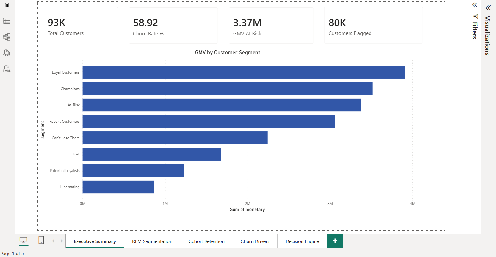
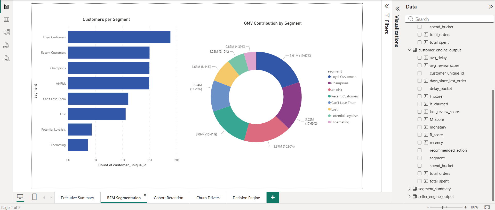
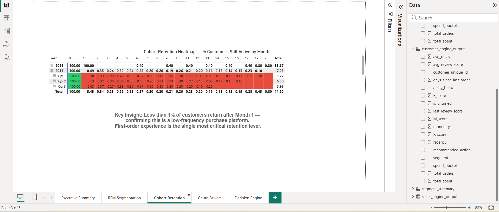
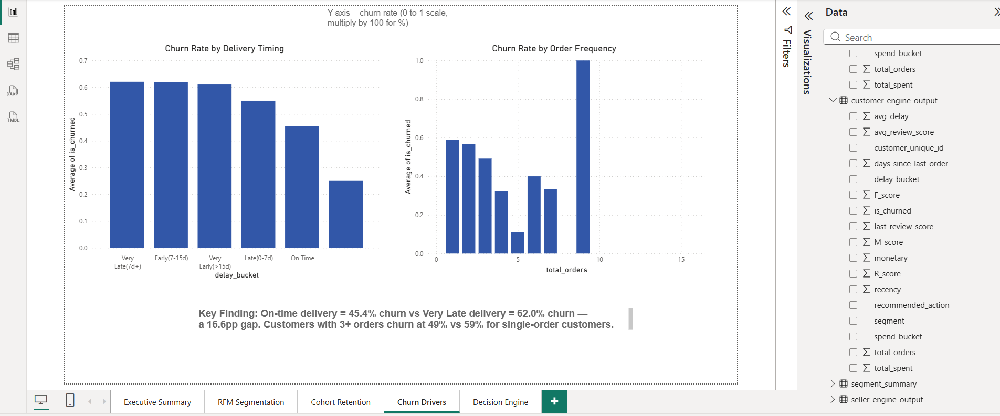
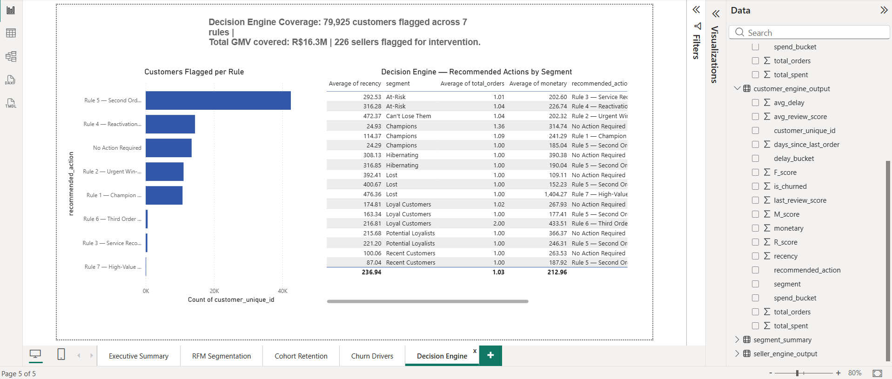

# 🛒 E-commerce Customer Churn Analytics
> End-to-end churn analytics system combining RFM segmentation, 
> cohort analysis, and a rule-based decision engine on 100k+ orders.

---

## 📌 Problem Statement
E-commerce platforms lose significant revenue to customer churn. 
This project identifies who is churning, why they are churning, 
and what actions the business should take — using real transaction data.

---

## 📊 Dataset
- **Source:** Olist Brazilian E-Commerce Dataset (Kaggle)
- **Size:** 99,441 orders | 93,358 unique customers | 3,095 sellers
- **Period:** 2016 – 2018
- **Tables used:** orders, customers, order_items, products, 
  sellers, reviews, payments (7 of 9 tables)

---

## 🔧 Tech Stack
| Tool | Purpose |
|------|---------|
| Python (Pandas, Matplotlib, Seaborn) | Data cleaning, EDA, analysis |
| SQL (SQLite) | Analytical queries, RFM, cohort |
| Power BI | Interactive 5-page dashboard |
| Google Colab | Development environment |
| GitHub | Version control + portfolio |

---

## 📁 Project Structure

ecommerce-churn-analytics/
│
├── notebooks/
│   └── churn_analysis.ipynb       # Full analysis notebook
│
├── sql/
│   ├── rfm_query.sql              # RFM segmentation query
│   ├── cohort_analysis.sql        # Cohort retention query
│   ├── churn_rate.sql             # Churn rate calculation
│   └── seller_cancel_rate.sql     # Seller RTO proxy query
│
├── dashboard/
│   └── ecommerce_churn_dashboard.pbix
│
├── outputs/
│   ├── rfm_segments_final.csv
│   ├── customer_engine_output.csv
│   └── seller_engine_output.csv
│
└── executive_summary.pdf

---

## 🔍 Methodology

### 1. Data Preparation
- Joined 7 tables into master dataframe (114,092 rows)
- Created delivery_delay column 
  (actual delivery − estimated delivery in days)
- Filtered to 96,478 delivered orders for churn analysis

### 2. RFM Segmentation
Scored every customer on Recency, Frequency, and Monetary 
dimensions (1–5 scale) and assigned to 8 behavioral segments.

### 3. Cohort Analysis
Tracked monthly retention curves from first purchase month. 
Identified platform purchase frequency pattern.

### 4. Churn Driver Analysis
Compared churned vs retained customers across delivery timing, 
review scores, and order frequency to identify actionable signals.

### 5. Rule-Based Decision Engine
Built a 7-rule Python engine that assigns every customer 
an automated business action based on their behavioral profile.

---

## 📈 Key Findings

### Finding 1 — Churn Rate
> **58.9% of customers churned** (55,006 out of 93,358)
> Churn defined as no purchase in 180+ days

### Finding 2 — Single Order Problem ⚠️ Most Critical
> **97% of customers placed only 1 order**
> Churn drops sharply with repeat purchases:
> 1 order → 59% churn | 3 orders → 49% | 5 orders → 11%
> Getting customers to order 3+ times is the 
> highest-leverage retention action

### Finding 3 — Delivery Impact
> On-time delivery → **45.4% churn rate**
> Very late delivery → **62.0% churn rate**
> **16.6 percentage point gap**
> Delivery timing is the strongest controllable churn signal

### Finding 4 — RFM Segments
| Segment | Customers | GMV |
|---------|-----------|-----|
| Champions | 14,961 | R$3.52M |
| At-Risk | 14,921 | R$3.37M |
| Can't Lose Them | 11,080 | R$2.24M |
| Lost | 10,588 | R$1.68M |

### Finding 5 — Decision Engine
> **79,925 customers flagged** across 7 rules
> **R$16.3M GMV** covered by engine
> **226 sellers** flagged for intervention → R$2.33M seller GMV

---

## ⚙️ Decision Engine Rules

| Rule | Condition | Action |
|------|-----------|--------|
| Rule 1 | Champions inactive 45+ days | Loyalty reward |
| Rule 2 | Can't Lose Them segment | Urgent win-back |
| Rule 3 | At-Risk + delivery delay >7d | Service recovery |
| Rule 4 | At-Risk segment | Reactivation campaign |
| Rule 5 | 1 order + good experience | Second order nudge |
| Rule 6 | 2 orders + inactive 90d | Third order conversion |
| Rule 7 | Lost + high spend (>R$500) | Premium re-engagement |

---

## 📊 Dashboard Preview

### Page 1 — Executive Summary

### Page 2 — RFM Segmentation

### Page 3 — Cohort Retention

### Page 4 — Churn Drivers

### Page 5 — Decision Engine

---

## 💡 Business Recommendations

1. **Launch second-order conversion campaign** for 42,452 
   customers with good first experience (Rule 5) — 
   highest volume opportunity at R$7.7M GMV
   
2. **Prioritise on-time delivery** — 16.6pp churn gap between 
   on-time and very late deliveries. Delivery SLA enforcement 
   is the single most controllable churn lever
   
3. **Urgent outreach for Can't Lose Them segment** — 
   11,080 customers, R$2.24M GMV, 100% churn rate. 
   These were frequent buyers who have gone silent.

4. **Seller quality intervention** — 226 sellers flagged 
   representing R$2.33M GMV. Focus on 6 sellers with 
   poor ratings + high volume (Rule B)

---

## 🚀 How to Run

1. Clone this repo
2. Download Olist dataset from Kaggle
3. Open `notebooks/churn_analysis.ipynb` in Google Colab
4. Mount Google Drive and update `data_path`
5. Run all cells top to bottom

---
